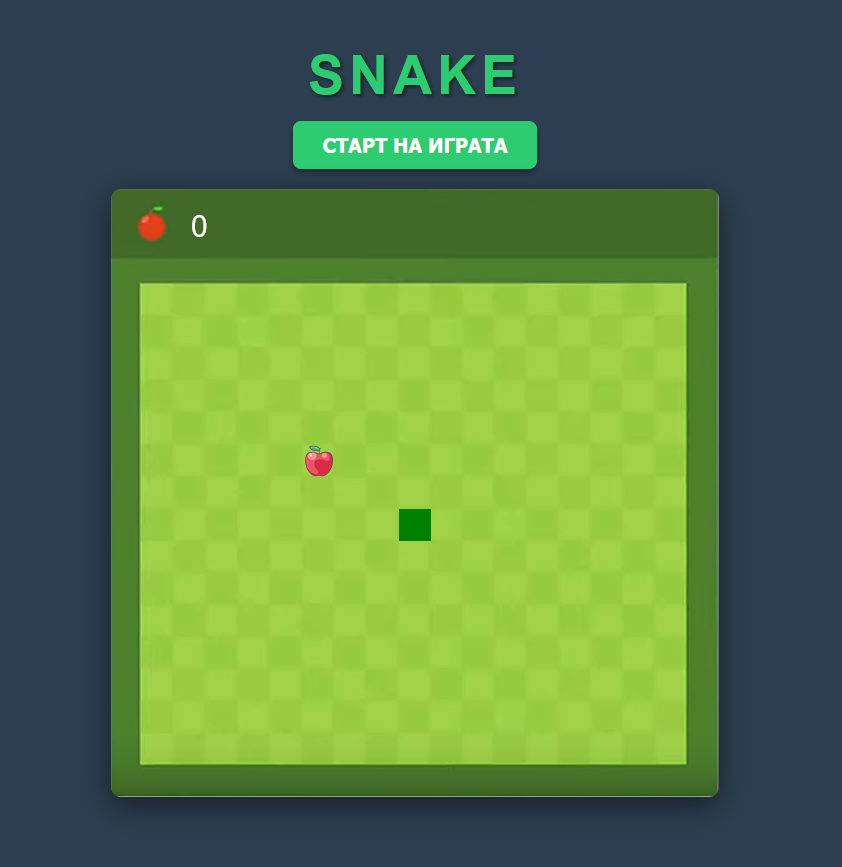

# 🐍 Classic Snake Game

A classic retro Snake Game built using Vanilla JavaScript and HTML5 Canvas. The game features grid-based movement, responsive keyboard controls, dynamic food spawning, and score tracking.

## 🎮 How to Play

1. Open `index.html` in any modern web browser.
2. Click the **"Старт на играта"** (Start Game) button to begin.
3. Use the arrow keys to control the direction of the snake.
4. Eat the red apples to grow your snake and increase your score.
5. Avoid crashing into the grid borders or the snake's own tail.

## ⌨️ Controls

- **Arrow Up**: Move Up
- **Arrow Down**: Move Down
- **Arrow Left**: Move Left
- **Arrow Right**: Move Right

## 🛠️ Technical Details & Refactoring

- **Canvas Rendering**: Uses 2D canvas context to draw the snake grid (`box = 32px`), game arena backdrop, and apple sprite.
- **Accurate Collision Checks**: Refactored the game loop to apply direction velocities and verify boundaries (`snakeX < box || snakeX > box * 17` and `snakeY < 3 * box || snakeY > box * 17`) *before* updating the snake's body queue. This prevents the snake from clipping out of bounds on death.
- **Tail Collision Check (`eatTail`)**: Updated to return a boolean state, stopping the game loop instantly and rendering a clean `GAME OVER` banner on the screen.
- **Case-Sensitive Resource Pathing**: Renamed the style asset folder to lowercase `css` for cross-platform file system compatibility.
