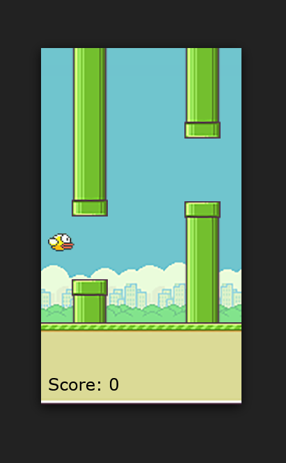

# 🐦 Flappy Bird Clone

An interactive 2D side-scrolling web game inspired by Flappy Bird, developed in Vanilla JavaScript and rendered using HTML5 Canvas.

## 🎮 How to Play

1. Open `index.html` in your web browser.
2. Press any key on your keyboard to make the bird flap its wings and lift upwards.
3. Gravity pulls the bird down continuously. Navigate through the openings in the green pipes.
4. Each successfully passed set of pipes increments your score and plays a sound effect.
5. If the bird touches a pipe or crashes into the ground, the game ends and restarts.

## ⌨️ Controls

- **Press Any Key**: Flap / Fly Up

## 🛠️ Technical Details & Refactoring

- **Canvas Physics**: Features simple gravitational acceleration (`grav = 1.5`) and velocity impulse changes on user input (`yPos -= 25`).
- **Dynamic Obstacle Generation**: Pipes are spawned dynamically using a queue array and random height offsets (`Math.random()`).
- **Asset Loading Security**: Refactored the game loop initialization from `pipeBottom.onload = draw` to standard `window.onload = draw`. This ensures all external graphics (bird, background, pipes) and audio assets (`fly.mp3`, `score.mp3`) are fully loaded by the browser before the game starts rendering, preventing canvas errors or early collision bugs.
